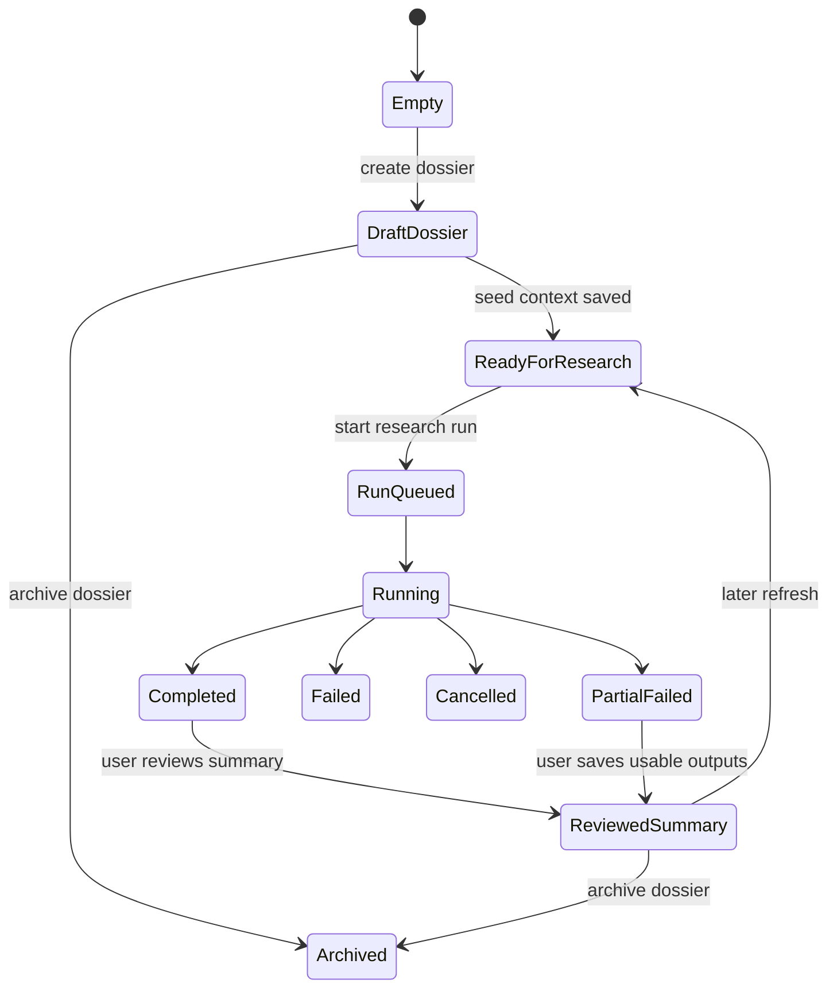

# Introduction

This specification defines the implementation requirements, constraints, interfaces, and validation criteria for the Investigator feature in JobOps. The feature introduces a company-centric, tenant-scoped research system that persists employer intelligence, people records, source evidence, research history, and AI-generated synthesis for reuse across jobs and interview preparation workflows.

## 1. Purpose & Scope

The purpose of this specification is to translate the completed Investigator PRD into an implementation-ready design for engineering, design, QA, and AI workflow integration.

Scope for v1:

- Create and manage persistent company dossiers.
- Link many jobs to one dossier.
- Run semi-automated, user-initiated research workflows.
- Persist sources, people records, salary observations, summaries, and timeline events.
- Reuse existing JobOps job metadata, notes, and tenant-scoped server patterns.
- Expose APIs, UI states, and data contracts that support future iteration.

Out of scope for v1:

- Autonomous continuous crawling without user initiation.
- Cross-tenant shared company libraries.
- Automatic outreach, contact enrichment, or application submission.
- Collection of private or non-professional personal data.

Intended audience:

- Product and design teams defining the first release.
- Full-stack engineers implementing server, client, and persistence changes.
- QA engineers validating multi-tenant and workflow behavior.
- Future AI workflow authors consuming investigator artifacts.

Assumptions:

- JobOps continues to use the existing orchestrator stack based on Express, React, TypeScript, Drizzle ORM, SQLite, and tenant-scoped server entities.
- Existing job records, job notes, and ready-panel search links remain authoritative adjacent systems.
- The existing API response contract and request ID behavior from [AGENTS.md](../AGENTS.md) remain mandatory.

## 2. Definitions

| Term | Definition |
|---|---|
| Investigator | The JobOps feature area for researching companies, people, compensation, and supporting evidence in a persisted way. |
| Dossier | A company-centric record containing identity fields, linked jobs, sources, summaries, people records, salary observations, and history. |
| Canonical Company Key | A normalized identifier for a company within a tenant, used to reduce duplicates across job-board naming variants. |
| Research Run | A user-initiated asynchronous workflow that gathers and organizes evidence for a dossier. |
| Source Artifact | A saved unit of evidence such as a web page, company page, public profile, manual note, or seeded job metadata excerpt. |
| People Record | A structured person entry tied to a dossier, such as recruiter, interviewer, executive, founder, hiring manager, or employee. |
| Salary Observation | A compensation data point with role scope, geography, confidence, and source attribution. |
| Summary | An AI-generated, user-editable synthesis artifact such as a company brief or interview angle list. |
| Timeline Event | An immutable history record describing dossier creation, run execution, manual edits, status changes, and other meaningful state changes. |
| Review State | A user-visible quality status indicating whether a source or summary is draft, reviewed, outdated, low-confidence, or similar. |
| Public Professional Context | Publicly available, work-related information such as title, employer, company website content, and professional profile content. |
| Tenant / Workspace | The active multi-tenant boundary used by JobOps server-side storage, APIs, logs, caches, and background work. |
| Seed Context | Existing company-related data already stored on jobs and used to initialize dossiers. |
| Hypothesis | An AI-generated inference that is not asserted as a source-grounded fact. |

## 3. Requirements, Constraints & Guidelines

### 3.1 Functional Requirements

| ID | Requirement | Priority |
|---|---|---|
| REQ-001 | The system shall allow a user to create a company dossier from a saved job, manual company name, or manual company URL. | High |
| REQ-002 | The system shall store each dossier as company-centric and allow one dossier to link to many jobs. | High |
| REQ-003 | The system shall maintain canonical company identity fields including company name, normalized URL or domain, canonical company key, status, tags, and last researched timestamp. | High |
| REQ-004 | The system shall seed dossier creation from existing job metadata when linked jobs already contain company description, employee count, revenue, rating, reviews, or salary metadata. | High |
| REQ-005 | The system shall support user-initiated research runs with at least the run kinds `company_brief`, `people_scan`, and `dossier_refresh`. | High |
| REQ-006 | The system shall persist run lifecycle data including status, timestamps, initiating context, sanitized errors, and generated artifact references. | High |
| REQ-007 | The system shall persist source artifacts with source attribution fields including URL, title, type, retrieval timestamp, excerpt, review state, and optional user annotations. | High |
| REQ-008 | The system shall support manual source creation, editing, removal, and review-state changes independent of automation. | High |
| REQ-009 | The system shall support structured people records with person type, role or title, profile URL, notes, source references, and confidence indicator. | High |
| REQ-010 | The system shall support salary observations with role scope, geography, currency, interval, amount range, confidence indicator, and source reference. | Medium |
| REQ-011 | The system shall generate AI summaries for company briefs, people briefs, and interview-oriented insights from saved dossier evidence. | High |
| REQ-012 | The system shall distinguish source-grounded facts from AI-generated hypotheses in every generated summary. | High |
| REQ-013 | The system shall keep generated summaries editable, regenerable, and versionable without deleting underlying source history. | High |
| REQ-014 | The system shall persist timeline events for dossier creation, job linking, run execution, source changes, people changes, summary saves, and status changes. | High |
| REQ-015 | The system shall expose dossier list, detail, filter, and search capabilities for company name, status, tag, stale state, linked job, and people-record presence. | Medium |
| REQ-016 | The system shall allow users to open a dossier from a job context and view all jobs linked to the dossier. | High |
| REQ-017 | The system shall allow users to promote saved investigator insights into existing job notes without overwriting existing notes implicitly. | High |
| REQ-018 | The system shall support partial research outcomes so users can save draft results even if some sources fail or are rate-limited. | High |
| REQ-019 | The system shall mark dossiers as `active`, `watchlist`, `interviewing`, `archived`, or `declined`. | Medium |
| REQ-020 | The system shall allow users to correct ambiguous company identity and merge dossiers only through explicit confirmation. | Medium |

### 3.2 Security, Privacy, and Compliance Requirements

| ID | Requirement |
|---|---|
| SEC-001 | All investigator records, background work, caches, files, and artifact retrieval shall be scoped to the active tenant or workspace. |
| SEC-002 | Investigator APIs shall return the standard JobOps API contract: success as `{ ok: true, data, meta: { requestId } }` and errors as `{ ok: false, error: { code, message, details? }, meta: { requestId } }`. |
| SEC-003 | Investigator routes shall honor and return `x-request-id` and include request context in logs. |
| SEC-004 | The system shall sanitize logs and error details, including URL payload excerpts, upstream bodies, tokens, cookies, and large raw responses. |
| SEC-005 | The system shall store only public professional context and user-authored notes for people records in v1. |
| SEC-006 | The UI and workflows shall not encourage collection or storage of personal, family, location-sensitive, or non-professional social data. |
| SEC-007 | Cross-tenant resource lookup shall not leak resource existence. Resource fetches for inaccessible records shall resolve as `404 NOT_FOUND` unless a broader permission rule explicitly requires `403 FORBIDDEN`. |

### 3.3 Non-Functional Requirements

| ID | Requirement |
|---|---|
| NFR-001 | Dossier list and dossier summary data shall support summary-first rendering with progressive loading of heavy evidence sections. |
| NFR-002 | Research runs shall execute asynchronously and expose durable status for refresh-safe UI polling. |
| NFR-003 | Source capture and summarization shall be rate-limit aware and resilient to partial failure. |
| NFR-004 | New schema and repository code shall follow existing JobOps TypeScript, Drizzle, and Express patterns without introducing a parallel persistence stack. |
| NFR-005 | The implementation shall preserve the user's ability to manually edit all persisted dossier artifacts after AI generation. |

### 3.4 Constraints

| ID | Constraint |
|---|---|
| CON-001 | v1 shall remain semi-automated and user-initiated. No continuous autonomous crawling is permitted. |
| CON-002 | v1 shall not auto-apply, auto-contact, or auto-message recruiters or employees. |
| CON-003 | Browser-assisted or search-assisted source collection shall remain review-gated before persistence of final summaries. |
| CON-004 | Cross-workspace sharing, public dossier publishing, and global company libraries are excluded from v1. |
| CON-005 | Source collection must respect external site terms of service and internal privacy defaults. |

### 3.5 Guidelines and Patterns

| ID | Guidance |
|---|---|
| GUD-001 | Reuse existing JobOps job notes and ready-panel search affordances where practical instead of creating duplicate primitives. |
| GUD-002 | Prefer immutable timeline events for auditability instead of destructive history replacement. |
| GUD-003 | Prefer explicit review-state fields over hidden AI confidence scoring. |
| PAT-001 | New investigator tables should follow the existing Drizzle table pattern with `id`, `tenantId`, `createdAt`, and `updatedAt` fields. |
| PAT-002 | Investigator routes should mirror existing Express route organization under `/api/*` with zod-validated inputs and structured error translation. |
| PAT-003 | Summary generation should persist fact and hypothesis sections separately so downstream consumers can apply different trust and display rules. |

## 4. Interfaces & Data Contracts

### 4.1 Domain Entities

#### 4.1.1 `investigator_dossiers`

| Field | Type | Required | Notes |
|---|---|---|---|
| id | text | Yes | Primary key |
| tenantId | text | Yes | References tenant scope |
| companyName | text | Yes | User-visible canonical company name |
| canonicalCompanyKey | text | Yes | Normalized identity key unique within tenant |
| companyUrl | text | No | Canonical website or careers URL |
| normalizedDomain | text | No | Lowercase domain if resolvable |
| status | enum | Yes | `active`, `watchlist`, `interviewing`, `archived`, `declined` |
| tags | json array of string | No | User-defined tags |
| lastResearchedAt | integer timestamp | No | Last completed or partial run timestamp |
| createdFromJobId | text | No | Initial seed job reference |
| createdAt | text datetime | Yes | Standard audit field |
| updatedAt | text datetime | Yes | Standard audit field |

Invariant:

- `tenantId + canonicalCompanyKey` must be unique.

#### 4.1.2 `investigator_dossier_jobs`

| Field | Type | Required | Notes |
|---|---|---|---|
| id | text | Yes | Primary key |
| tenantId | text | Yes | Tenant scope |
| dossierId | text | Yes | References dossier |
| jobId | text | Yes | References existing job |
| linkReason | enum | Yes | `seeded`, `manual`, `suggested` |
| createdAt | text datetime | Yes | Audit field |
| updatedAt | text datetime | Yes | Audit field |

Invariant:

- `tenantId + dossierId + jobId` must be unique.

#### 4.1.3 `investigator_research_runs`

| Field | Type | Required | Notes |
|---|---|---|---|
| id | text | Yes | Primary key |
| tenantId | text | Yes | Tenant scope |
| dossierId | text | Yes | References dossier |
| runKind | enum | Yes | `company_brief`, `people_scan`, `dossier_refresh` |
| status | enum | Yes | `queued`, `running`, `completed`, `partial_failed`, `failed`, `cancelled` |
| initiatedBy | enum | Yes | `user`, `system` |
| seedContext | json | No | Optional seed inputs such as linked job or query hints |
| startedAt | integer timestamp | No | Execution start |
| completedAt | integer timestamp | No | Execution end |
| errorCode | text | No | Sanitized error classification |
| errorMessage | text | No | Sanitized summary only |
| createdAt | text datetime | Yes | Audit field |
| updatedAt | text datetime | Yes | Audit field |

#### 4.1.4 `investigator_sources`

| Field | Type | Required | Notes |
|---|---|---|---|
| id | text | Yes | Primary key |
| tenantId | text | Yes | Tenant scope |
| dossierId | text | Yes | References dossier |
| runId | text | No | References research run |
| sourceType | enum | Yes | `company_site`, `news_article`, `public_profile`, `github_profile`, `review_site`, `salary_site`, `job_metadata`, `manual_note`, `other_web_page` |
| title | text | Yes | Human-readable label |
| url | text | No | Optional for manual notes or job-seeded artifacts |
| sourceHost | text | No | Normalized host if URL exists |
| capturedExcerpt | text | Yes | Minimal saved excerpt or user-entered content |
| retrievedAt | integer timestamp | Yes | When artifact was captured |
| reviewState | enum | Yes | `unreviewed`, `verified`, `low_confidence`, `outdated`, `rejected` |
| reviewerNote | text | No | Optional user annotation |
| contentHash | text | No | Optional dedupe signal |
| createdAt | text datetime | Yes | Audit field |
| updatedAt | text datetime | Yes | Audit field |

#### 4.1.5 `investigator_people`

| Field | Type | Required | Notes |
|---|---|---|---|
| id | text | Yes | Primary key |
| tenantId | text | Yes | Tenant scope |
| dossierId | text | Yes | References dossier |
| runId | text | No | Optional originating run |
| fullName | text | Yes | Person display name |
| personType | enum | Yes | `recruiter`, `hiring_manager`, `interviewer`, `executive`, `founder`, `employee` |
| title | text | No | Current or inferred title |
| profileUrl | text | No | Public professional profile URL |
| roleContext | text | No | Why the person matters to this dossier |
| notes | text | No | User-authored prep notes in markdown |
| confidenceLabel | enum | Yes | `high`, `medium`, `low`, `unknown` |
| sourceIds | json array of text | No | Supporting source references |
| createdAt | text datetime | Yes | Audit field |
| updatedAt | text datetime | Yes | Audit field |

#### 4.1.6 `investigator_salary_observations`

| Field | Type | Required | Notes |
|---|---|---|---|
| id | text | Yes | Primary key |
| tenantId | text | Yes | Tenant scope |
| dossierId | text | Yes | References dossier |
| runId | text | No | Optional originating run |
| roleScope | text | No | Role or level associated with the comp data |
| geoScope | text | No | Region, market, or location |
| currency | text | No | ISO currency when known |
| payInterval | enum | No | `annual`, `monthly`, `hourly`, `unknown` |
| minAmount | real | No | Lower bound |
| maxAmount | real | No | Upper bound |
| equityText | text | No | Non-normalized equity note |
| bonusText | text | No | Non-normalized bonus note |
| confidenceLabel | enum | Yes | `high`, `medium`, `low`, `unknown` |
| sourceId | text | No | Supporting source |
| observedAt | integer timestamp | No | When the observation was current |
| notes | text | No | User note |
| createdAt | text datetime | Yes | Audit field |
| updatedAt | text datetime | Yes | Audit field |

#### 4.1.7 `investigator_summaries`

| Field | Type | Required | Notes |
|---|---|---|---|
| id | text | Yes | Primary key |
| tenantId | text | Yes | Tenant scope |
| dossierId | text | Yes | References dossier |
| runId | text | No | Optional generating run |
| summaryType | enum | Yes | `company_brief`, `people_brief`, `interview_angles` |
| title | text | Yes | Summary label |
| bodyMarkdown | text | Yes | User-editable markdown |
| factsJson | json array | Yes | Explicit source-grounded facts |
| hypothesesJson | json array | Yes | Explicit AI inferences |
| reviewState | enum | Yes | `draft`, `reviewed` |
| version | integer | Yes | Incrementing version within summary type |
| createdAt | text datetime | Yes | Audit field |
| updatedAt | text datetime | Yes | Audit field |

#### 4.1.8 `investigator_timeline_events`

| Field | Type | Required | Notes |
|---|---|---|---|
| id | text | Yes | Primary key |
| tenantId | text | Yes | Tenant scope |
| dossierId | text | Yes | References dossier |
| runId | text | No | Optional associated run |
| eventType | enum | Yes | `dossier_created`, `job_linked`, `run_started`, `run_completed`, `run_partial_failed`, `run_failed`, `source_saved`, `source_reviewed`, `person_saved`, `salary_saved`, `summary_saved`, `status_changed`, `dossier_merged` |
| payload | json | Yes | Minimal event context |
| occurredAt | integer timestamp | Yes | Business time |
| createdAt | text datetime | Yes | Audit field |
| updatedAt | text datetime | Yes | Audit field |

### 4.2 Enumerations

```json
{
  "dossierStatus": ["active", "watchlist", "interviewing", "archived", "declined"],
  "runKind": ["company_brief", "people_scan", "dossier_refresh"],
  "runStatus": ["queued", "running", "completed", "partial_failed", "failed", "cancelled"],
  "sourceReviewState": ["unreviewed", "verified", "low_confidence", "outdated", "rejected"],
  "summaryReviewState": ["draft", "reviewed"],
  "personType": ["recruiter", "hiring_manager", "interviewer", "executive", "founder", "employee"],
  "confidenceLabel": ["high", "medium", "low", "unknown"]
}
```

### 4.3 API Contracts

All new routes shall live under `/api/investigator/*` and follow the standard JobOps response contract.

#### 4.3.1 Dossier routes

| Method | Route | Purpose |
|---|---|---|
| GET | `/api/investigator/dossiers` | List dossiers with filters `q`, `status`, `tag`, `linkedJobId`, `hasPeople`, `stale`, `sort` |
| POST | `/api/investigator/dossiers` | Create dossier |
| GET | `/api/investigator/dossiers/:dossierId` | Fetch dossier detail |
| PATCH | `/api/investigator/dossiers/:dossierId` | Update dossier fields |
| POST | `/api/investigator/dossiers/:dossierId/jobs` | Link job to dossier |
| DELETE | `/api/investigator/dossiers/:dossierId/jobs/:jobId` | Unlink job from dossier |
| POST | `/api/investigator/dossiers/:dossierId/merge` | Explicitly merge another dossier into this dossier |

Example create request:

```json
{
  "companyName": "Acme AI",
  "companyUrl": "https://acme.ai",
  "sourceJobId": "job_123",
  "status": "active",
  "tags": ["priority", "platform"]
}
```

Example success response:

```json
{
  "ok": true,
  "data": {
    "id": "dos_123",
    "companyName": "Acme AI",
    "canonicalCompanyKey": "acme-ai|acme.ai",
    "companyUrl": "https://acme.ai",
    "status": "active",
    "tags": ["priority", "platform"],
    "lastResearchedAt": null,
    "linkedJobs": [{ "jobId": "job_123" }],
    "createdAt": "2026-05-23T10:00:00Z",
    "updatedAt": "2026-05-23T10:00:00Z"
  },
  "meta": { "requestId": "req_abc" }
}
```

#### 4.3.2 Research run routes

| Method | Route | Purpose |
|---|---|---|
| POST | `/api/investigator/dossiers/:dossierId/runs` | Start a run |
| GET | `/api/investigator/dossiers/:dossierId/runs` | List runs |
| GET | `/api/investigator/dossiers/:dossierId/runs/:runId` | Fetch run detail and artifacts |
| POST | `/api/investigator/dossiers/:dossierId/runs/:runId/cancel` | Cancel a running run |

Example start-run request:

```json
{
  "runKind": "people_scan",
  "seedContext": {
    "linkedJobId": "job_123",
    "queryHints": ["site:linkedin.com/in \"Acme AI\" recruiter", "site:github.com \"Acme AI\""]
  }
}
```

#### 4.3.3 Source routes

| Method | Route | Purpose |
|---|---|---|
| GET | `/api/investigator/dossiers/:dossierId/sources` | List sources |
| POST | `/api/investigator/dossiers/:dossierId/sources` | Create source manually or save captured source |
| PATCH | `/api/investigator/dossiers/:dossierId/sources/:sourceId` | Update source review state or annotation |
| DELETE | `/api/investigator/dossiers/:dossierId/sources/:sourceId` | Remove source |

#### 4.3.4 People routes

| Method | Route | Purpose |
|---|---|---|
| GET | `/api/investigator/dossiers/:dossierId/people` | List people records |
| POST | `/api/investigator/dossiers/:dossierId/people` | Create person |
| PATCH | `/api/investigator/dossiers/:dossierId/people/:personId` | Update person |
| DELETE | `/api/investigator/dossiers/:dossierId/people/:personId` | Delete person |

#### 4.3.5 Salary routes

| Method | Route | Purpose |
|---|---|---|
| GET | `/api/investigator/dossiers/:dossierId/salary-observations` | List salary observations |
| POST | `/api/investigator/dossiers/:dossierId/salary-observations` | Create salary observation |
| PATCH | `/api/investigator/dossiers/:dossierId/salary-observations/:observationId` | Update salary observation |
| DELETE | `/api/investigator/dossiers/:dossierId/salary-observations/:observationId` | Delete salary observation |

#### 4.3.6 Summary routes

| Method | Route | Purpose |
|---|---|---|
| GET | `/api/investigator/dossiers/:dossierId/summaries` | List summaries |
| POST | `/api/investigator/dossiers/:dossierId/summaries/regenerate` | Generate new summary version |
| PATCH | `/api/investigator/dossiers/:dossierId/summaries/:summaryId` | Edit or review a summary |

#### 4.3.7 Timeline route

| Method | Route | Purpose |
|---|---|---|
| GET | `/api/investigator/dossiers/:dossierId/timeline` | Retrieve ordered history feed |

### 4.4 Reuse of Existing Job Notes Contract

Promotion of investigator insights into job notes shall reuse the existing jobs note route instead of introducing a new duplicate notes subsystem.

Reused route:

| Method | Route | Purpose |
|---|---|---|
| POST | `/api/jobs/:jobId/notes` | Create a note from an investigator insight |

Constraint:

- The investigator feature may prefill the note title and content, but the user must confirm before save.

### 4.5 UI State Model



### 4.6 Example Detail Payload

```json
{
  "id": "dos_123",
  "companyName": "Acme AI",
  "status": "active",
  "tags": ["priority"],
  "linkedJobs": [
    { "jobId": "job_123", "title": "Senior Platform Engineer", "status": "ready" }
  ],
  "sources": [
    {
      "id": "src_1",
      "sourceType": "company_site",
      "title": "About Acme AI",
      "url": "https://acme.ai/about",
      "reviewState": "verified"
    }
  ],
  "people": [
    {
      "id": "per_1",
      "fullName": "Jane Doe",
      "personType": "recruiter",
      "title": "Senior Recruiter",
      "confidenceLabel": "medium"
    }
  ],
  "summaries": [
    {
      "id": "sum_1",
      "summaryType": "company_brief",
      "reviewState": "draft",
      "version": 1
    }
  ],
  "timeline": [
    {
      "id": "evt_1",
      "eventType": "dossier_created",
      "occurredAt": 1747994400
    }
  ]
}
```

## 5. Acceptance Criteria

- **AC-001**: Given a saved job with an employer name, when the user creates a dossier from that job, then the dossier is created with seeded company metadata and a link to the originating job.
- **AC-002**: Given an existing dossier for a canonical company, when the user links a second job from the same company, then both jobs appear on the dossier and no duplicate dossier is created automatically.
- **AC-003**: Given a user starts a `company_brief` research run, when the run is accepted, then the API returns a persisted run record and the UI can refresh its status safely.
- **AC-004**: Given a research run collects multiple sources, when the run completes, then each major insight shown in generated output can be traced to at least one saved source artifact.
- **AC-005**: Given the user adds a person record without a profile URL, when the person is saved, then the dossier still accepts the record with notes and confidence state if required fields are present.
- **AC-006**: Given a generated company brief contains AI inferences, when the brief is rendered, then source-grounded facts and hypotheses are visually and structurally distinct.
- **AC-007**: Given a user edits a generated summary, when the summary is saved, then the edited version persists without deleting prior source artifacts or prior summary versions.
- **AC-008**: Given some sources fail during a research run, when the run completes with usable artifacts, then the run status is `partial_failed` and the user can still save draft results.
- **AC-009**: Given a dossier contains many linked artifacts, when the detail page loads, then summary content renders before full evidence expansion and the page remains usable without loading every excerpt first.
- **AC-010**: Given a user filters dossiers for stale research, when stale filtering is applied, then dossiers meeting the stale rule are returned and non-stale dossiers are excluded.
- **AC-011**: Given a user promotes an investigator insight to a job note, when the note is saved, then the note is created through the existing job notes API and existing notes remain unchanged unless explicitly edited.
- **AC-012**: Given a user from tenant A requests a dossier belonging to tenant B, when the request is processed, then the response does not leak the existence of tenant B's dossier and returns the standard error contract.
- **AC-013**: Given the system logs a route or run failure, when the log entry is emitted, then the entry contains request context and sanitized details without raw sensitive payloads.
- **AC-014**: Given the user corrects a misidentified company and merges dossiers, when the merge is confirmed, then a timeline event records the change and linked jobs remain associated with the merged destination dossier.
- **AC-015**: Given a people-research workflow is used, when the user reviews results, then the feature only stores public professional context and user-authored notes for saved people records.

## 6. Test Automation Strategy

- **Test Levels**: Unit, Integration, UI integration, End-to-End workflow verification.
- **Frameworks**: Vitest, Testing Library, jsdom, TypeScript compiler, Biome.
- **Repository Commands**:
  - `./orchestrator/node_modules/.bin/biome ci .`
  - `npm run check:types:shared`
  - `npm --workspace orchestrator run check:types`
  - `npm --workspace gradcracker-extractor run check:types`
  - `npm --workspace ukvisajobs-extractor run check:types`
  - `npm --workspace orchestrator run build:client`
  - `npm --workspace orchestrator run test:run`
- **Unit Test Scope**:
  - Canonical company key normalization.
  - Run state transitions.
  - Fact versus hypothesis serialization.
  - Filter and stale-state computations.
  - Input validation for dossier, source, people, and summary payloads.
- **Integration Test Scope**:
  - Repository CRUD for all investigator entities.
  - Tenant isolation across every repository and route.
  - Cascading behavior for dossier deletion and job linking.
  - Sanitized route error behavior and request ID propagation.
  - Promotion of investigator insight into existing job notes.
- **UI Integration Scope**:
  - Create dossier from job context.
  - Run creation, status refresh, and partial-failure handling.
  - Source review state updates.
  - Person record create and edit flows.
  - Summary review and version update flows.
- **End-to-End Scope**:
  - Create dossier from job, run company brief, review artifacts, promote insight to note, and revisit dossier from a second linked job.
  - Validate that archived dossiers still expose historical timeline data.
- **Test Data Management**:
  - Use isolated test databases or per-test schema reset patterns already used by orchestrator tests.
  - Seed tenant-specific fixtures for jobs, dossiers, sources, people, and summaries.
  - Ensure multi-tenant tests include at least two tenants with overlapping company names.
- **Coverage Requirements**:
  - Every new public investigator route must have direct integration coverage.
  - Every new repository must have CRUD and tenant-isolation coverage.
  - Every state transition in the research run lifecycle must have direct automated test coverage.
  - Numeric coverage thresholds are optional; risk-based route and state coverage is mandatory.
- **CI/CD Integration**:
  - Targeted tests for the touched investigator slice should run first.
  - Full CI-parity commands listed above must pass before the implementation is considered complete.
- **Performance Testing**:
  - Add focused benchmarks or load-like repository tests for dossier list queries with high source counts.
  - Validate run polling behavior under concurrent queued and running runs.
  - Verify detail-page summary rendering remains responsive when dossier evidence collections are large.

## 7. Rationale & Context

The PRD establishes that JobOps already has strong job tracking, note-taking, and company metadata, but lacks a reusable research system. A company-centric design is the correct v1 choice because company intelligence often outlives an individual job listing and should compound across multiple applications and interviews.

The design intentionally extends existing systems instead of replacing them:

- Existing job data seeds dossiers.
- Existing job notes remain the destination for promoted insights.
- Existing ready-panel search link behavior informs guided people and company discovery.
- Existing tenant and API standards constrain how new investigator routes behave.

The semi-automated approach is deliberate. It balances usefulness with legal, privacy, and trust concerns. The feature should help the user search, collect, summarize, and organize, but not silently scrape or autonomously accumulate sensitive data. Review states, explicit source attribution, and clear separation of facts from hypotheses are required because opaque AI summaries would reduce trust and make the feature hard to use for interview preparation.

The immutable timeline is included because the product goal is not just storage. The feature must preserve what changed, when it changed, and which evidence supported a conclusion at the time. This gives users a practical long-lived dossier rather than another transient AI chat output.

## 8. Dependencies & External Integrations

### External Systems

- **EXT-001**: Existing JobOps jobs domain - Supplies employer identity and seeded company metadata.
- **EXT-002**: Existing JobOps job notes domain - Receives promoted investigator insights.
- **EXT-003**: Existing JobOps tenant and request-context infrastructure - Enforces tenant isolation and request correlation.

### Third-Party Services

- **SVC-001**: Configured LLM provider - Generates summaries and structured synthesis using existing JobOps AI provider infrastructure.
- **SVC-002**: Public web search and fetch tools - Support guided research and evidence capture in user-initiated flows.
- **SVC-003**: Public professional web sources - Company sites, public profiles, and public compensation or review pages subject to source terms.

### Infrastructure Dependencies

- **INF-001**: SQLite plus Drizzle ORM persistence in orchestrator.
- **INF-002**: Existing asynchronous server execution pattern for background or queued work.
- **INF-003**: Existing logging, request ID propagation, and error translation infrastructure.

### Data Dependencies

- **DAT-001**: Existing job fields including employer, company description, employee count, revenue, rating, review count, and salary metadata.
- **DAT-002**: User-authored notes and annotations.
- **DAT-003**: Publicly accessible professional pages and company pages captured during user-initiated research.

### Technology Platform Dependencies

- **PLT-001**: Node 22 runtime and TypeScript across workspace packages.
- **PLT-002**: Express route structure and zod request validation in orchestrator.
- **PLT-003**: React plus TanStack Query client patterns for dossier screens and polling.

### Compliance Dependencies

- **COM-001**: Public professional context only for people research in v1.
- **COM-002**: Existing JobOps sanitization, API contract, and tenant-isolation standards from [AGENTS.md](../AGENTS.md).
- **COM-003**: Respect for source terms of service and user-initiated browsing boundaries.

**Note**: This section describes architectural dependencies and operational constraints. It does not require any specific external commercial enrichment vendor for v1.

## 9. Examples & Edge Cases

### 9.1 Example: Dossier created from a linked job

```json
{
  "createInput": {
    "companyName": "Acme AI",
    "sourceJobId": "job_123"
  },
  "seededFields": {
    "companyDescription": "AI infrastructure platform",
    "companyNumEmployees": "201-500",
    "companyRating": 4.2,
    "companyReviewsCount": 118
  },
  "expectedResult": {
    "dossierCreated": true,
    "jobLinked": true,
    "status": "active"
  }
}
```

### 9.2 Example: Partial research run with reviewable output

```json
{
  "runKind": "people_scan",
  "sourcesAttempted": 4,
  "sourcesSaved": 3,
  "sourcesFailed": 1,
  "runStatus": "partial_failed",
  "summaryReviewState": "draft",
  "userMaySave": true
}
```

### 9.3 Example: Fact and hypothesis separation

```json
{
  "facts": [
    {
      "statement": "The company announced a Series C round in March 2026.",
      "sourceIds": ["src_10"]
    }
  ],
  "hypotheses": [
    {
      "statement": "The recent hiring spike may indicate expansion of the platform team.",
      "sourceIds": ["src_11", "src_12"]
    }
  ]
}
```

### 9.4 Edge cases

```text
1. Two jobs from the same employer use different employer strings such as “Acme AI” and “Acme AI, Inc.”.
   Expected: canonical company resolution suggests one dossier and warns before duplicate creation.

2. A recruiter is known only by name from an email signature, with no public profile URL.
   Expected: person record can still be created with notes and low or unknown confidence.

3. A source becomes stale or removed after a prior run.
   Expected: existing saved excerpt remains, source can be marked outdated, and later summaries can exclude it.

4. A dossier is archived and later revisited for a new role.
   Expected: archive status can be reversed without losing runs, sources, or linked job history.

5. Two tenants research the same employer.
   Expected: records remain fully isolated and never appear across tenants.
```

## 10. Validation Criteria

- Investigator schema includes tenant-scoped entities for dossiers, job links, runs, sources, people, salary observations, summaries, and timeline events.
- Every new investigator route returns the standard JobOps API response contract and `x-request-id` header.
- Dossier creation from a job uses existing company metadata as seed context when available.
- Source artifacts and summaries demonstrate traceability between displayed conclusions and saved evidence.
- Generated summaries preserve explicit fact and hypothesis sections.
- Partial run handling allows useful draft persistence rather than forcing all-or-nothing outcomes.
- Promotion to job notes reuses the existing job notes API and preserves prior notes unless the user chooses to edit them.
- Tenant isolation is covered across repositories, routes, background work, caches, and storage paths.
- Logs and route errors are structured and sanitized according to repository rules.
- UI states cover empty, seeded, running, completed, partial-failed, archived, and stale dossier scenarios.
- All required CI-parity checks and investigator-specific tests pass.

## 11. Related Specifications / Further Reading

- [Investigator PRD](./iinvestigator.prd.md)
- [Workspace Rules](../AGENTS.md)
- [Orchestrator Feature Docs](../docs-site/docs/features/orchestrator.md)
- [Ready Panel Search Links](../orchestrator/src/client/components/ready-panel-google-dorks.ts)
- [Jobs Note Routes](../orchestrator/src/server/api/routes/jobs/notes.ts)
- [Jobs Route Shared Schemas](../orchestrator/src/server/api/routes/jobs/shared.ts)
- [Database Schema](../orchestrator/src/server/db/schema.ts)

> **Next step**: Once this specification is reviewed, derive implementation issues or tasks from the REQ, SEC, NFR, and AC items, then refine each issue with testable acceptance criteria before planning execution.